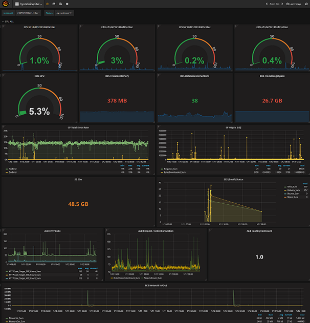

#### Customer : Coinnest

### Customer needs
1. A cloud service with reduced TCO comparing On-premise.
2. Need for a Cloud based service which is adequate for Enterprise Digital Transformation strategy.
3. Need for a configuration that can flexibly handle massive traffic.
4. Service must be operable 24 hours without downtime because it is cryptocurrency exchange service. 
5. Service must defend DDoS attacks with no failure point.

### Architecture
- Cryptocurrency exchange website construction.
- Duplex and Multi-Az configuration for each product server.
- Use DDoS defense and web acceleration effect by CloudFront configuration. (When using Global)
- All the services are configured as Private Subnet, and system for actual operation such as Bastion Host are configured separately as Public Subnet. 
- Duplex configuration for operating server load balancing. Multi-AZ and AutoScale Group configuration for Az FailOver.
- Adopted Security Control for IPS/WAF by utilizing 3rd party solution.

### Architecture compliance
- Suggest the client an implementation method complying with the guidelines of AWS Architecting for the Cloud(AWS Best Practice) Design Principles.

### Monitoring

- Saltware(as fitCloud) provide monitoring service
- Provide Real time monitoring for AWS resources.
- Monitoring composed of indexes representing server performance such as CPU, Memory, Disk, Traffic, etc.
- Multi-dimensional resource visualization by linking with CloudWatch. 
- Support Multi-Region resource.
- Activate e-mail notification when each performance index reaches the configured threshold.

### On-premise vs AWS TCO compare

- Through TCO analyzation, we achieved AWS TCO Calculator result indicating possible 32% cost reduction.
- The comparison was done with 10 On-premise based servers. More discount rates can be expected at actual implementation using 5 servers that can extend into maximum 10 servers with AutoScaling.
- TCO analyzation was done in Tokyo Region which is most adjacent to Seoul Region.
- This is a 3 year TCO analyzation result. Even though there are price differences in On-premise server price of Seoul Region, we were able to come up with the discount rate shown in the result by adding operational manpower of the actual data center, electric charge, and extra expenses into the calculation.
- When the peak of a certain instance exceeds the limit of the corresponding physical server, On-premise requires extra server purchase but AWS uses AutoScaling which reduces burden of expense.
