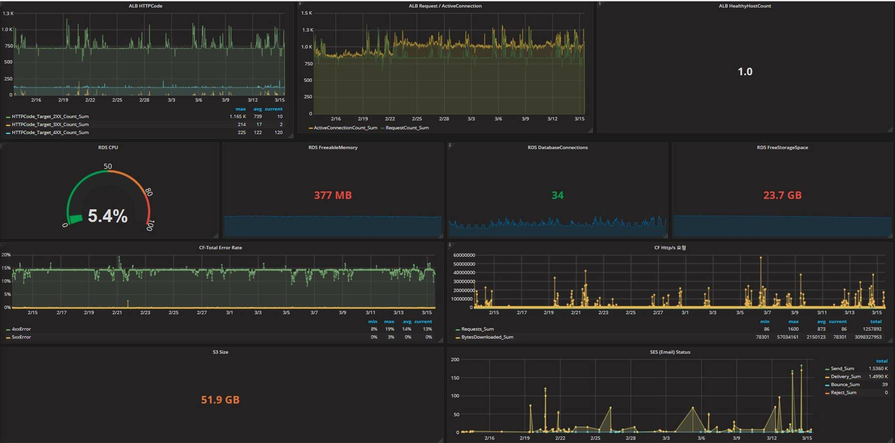

https://investments.miraeasset.com

#### Customer : Mirae Asset Global Investment

### Customer needs
1. Consideration for a global cloud service due to the dependency on global website for marketing purpose.
2. Need for improving access speed for foreign users.
3. A cloud service with reduced TCO compared to On-premise. (Substitute the obsolete and unstable pre-existing system)
4. Need for a Cloud based service which is adequate for Enterprise Digital Transformation strategy.

### Architecture
- 3tier architecture service (WEB-WAS-DB)
- Separate implementation per region: Tokyo(Group, Asset), Singapore(Global) 
- Duplex and Multi-Az configuration for each product server.
- Duplex configuration for operating server load balancing. Multi-AZ and AutoScale Group configuration for Az FailOver.
- Defend DDoS and use web acceleration effect with CloudFront configuration. 
- Use ACM service for HTTPS communication in CloudFront
- Route53 configuration for global service

### Architecture compliance
- Suggest the client an implementation method complying with the guidelines of AWS Architecting for the Cloud(AWS Best Practice) Design Principles.

### Monitoring

- Saltware(as fitCloud) provide monitoring service
- Provide Real time monitoring for AWS resources.
- Monitoring composed of indexes representing server performance such as CPU, Memory, Disk, Traffic, etc.
- Multi-dimensional resource visualization by linking with CloudWatch. 
- Support Multi-Region resource.
- Activate e-mail notification when each performance index reaches the configured threshold.

### on-premise vs AWS TCO compare

- Through TCO analyzation, we achieved AWS TCO Calculator result indicating possible 91% cost reduction.
- Analyzation was done in Tokyo Region and Singapore Region.
- This is a 3 year TCO analyzation result. Even though there are price differences in On-premise server price of Seoul Region, we were able to come up with the discount rate shown in the result by adding operational manpower of the actual data center, electric charge, and extra expenses into the calculation.
- More discounts are expected due to the difference in charging methods when the peak of a certain instance exceeds the limit of the corresponding physical server. On-premise requires extra server purchase but AWS uses AutoScaling and charges costs on additionally established instances per second.
