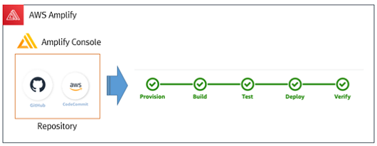

http://www.refine.co.kr

#### Customer : Refine

### Problem statement/definition
- **Customers were migrating services from their existing on-premise environment to a local cloud company, but Migrating to AWS Cloud and Operating due to guaranteed function and performance problems.**
- Most of the services are currently being developed and operated on AWS Cloud except for personal information, mostly in B2B area, server development is mostly in operation, implemented as a typical Monolithic service.
- AWS's service proposal to address new requirements for mobile development with B2C rather than existing B2B areas where new areas of business need to be developed.
- There was no mobile development staff among the internal development staff, even company developers have no experience in cloud-based mobile development, Need ways to achieve results in a short project period.
- **Consider the development of Google's Firehose foundation for the first time, but propose an Amplify like AWS**
- **Development and Optimization Based on Amplify, and Serverless-based service development requirements require access to MSA and DevOps, which lead to the project**

### How AWS services were used as part of the solution
#### AWS Service Used
+ **Amplify**
+ **Amplify Console (CI/CD) : Git / CodeCommit / CodeBuild & Deploy**
+ **Cloud Formation**
+ **API Gateway (Front & Back) / SQS / CloudWatch & ElasticSearch / CloudWatch**
+ **IAM, Etc… (ELB,RDS etc.)**

### Third party applications or solutions used
+ **Utilize JUUL API**
+ **Google Analytics**

### Outcomes
- **Enhanced the security by gaining visibility into AWS Resource usage by team and** Service Groups by VPC **through Account separation**
- Get active serverless-based services by using Amplify
- **Improve quality and performance of applications**
- **Increase the convenience of deployment with Amplify's CI/CD automation, reduce application deployment time and release time**
- Reduce costs by increasing the utilization of existing server development personnel by automating mobile development.
- **Security achieved by service segregation from each VPC**

