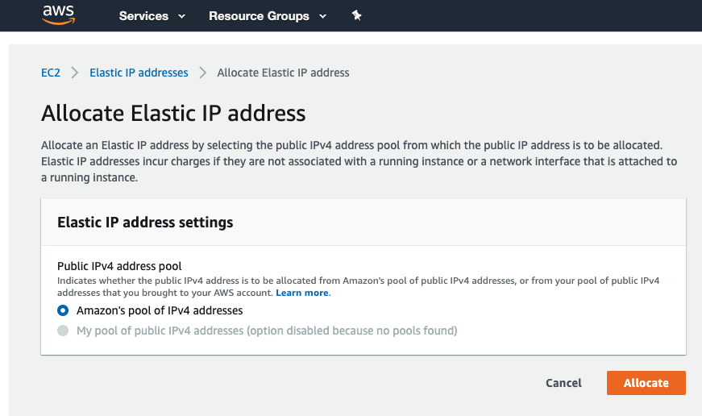
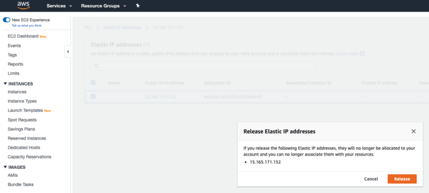
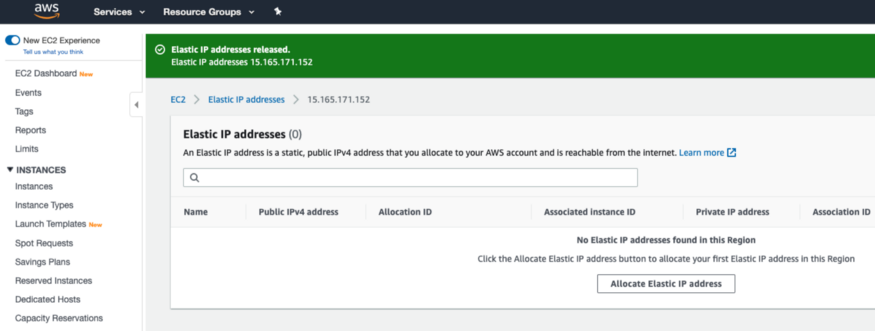

만약 실수로 또는 더이상 필요하지 않아서 Elastic IP를 해제 (Release) 했을 때 아래와 같은 조건을 충족한다면 해제한 Elastic IP를 복구 할 수 있습니다.

 1. 해당 Elastic IP가 다른 계정에 할당되지 않았을 경우
 2. Elastic IP 할당 한도가 초과되지 않았을 경우

우선 Elastic IP를 생성해보도록 하겠습니다.

AWS Management Console 에서 좌측 상단에 있는 [Services] 를 선택하고 검색창에서 EC2를 검색하거나 [Compute] 바로 밑에 있는 [EC2] 를 선택 후 [Elastic IPs] → [Allocate new address] → [Allocate] 클릭

생성된 Elastic IP 주소를 메모하고 할당받은 Elastic IP 주소를 해제하겠습니다. 방금 할당받은 Elastic IP 선택 → [Actions] → [Release Elastic IP addresses] → [Release]

이제 AWS CLI를 사용해서 방금 해제한 Elastic IP를 복구해보겠습니다.

    $ aws ec2 allocate-address --domain vpc --address 15.165.171.152
    {
        "PublicIp": "15.165.171.152",
        "Domain": "vpc",
        "AllocationId": "eipalloc-0607f43dcb7fe1b44",
        "PublicIpv4Pool": "amazon"
    }

방금 해제한 Elastic IP를 성공적으로 복구했습니다. 하지만 위에서 언급했듯이 해제한 Elastic IP가 다른 AWS 계정에 할당되지 않을때 경우에만 복구가 가능하구요. 만약 재할당을 요청하기 전에 이미 해당 Elastic IP 주소가 다른 계정에 할당되었다면 아래와 같은 에러메세지가 Return 됩니다.

    An error occurred (InvalidAddress.NotFound) when calling the AllocateAddress operation: The Elastic IP address 'xxx.xxx.xxx.xxx' does not exist or is not available.

100% 복구된다는 보장은 없으니 Elastic IP는 최대한 해제하지 않는 쪽으로 😃